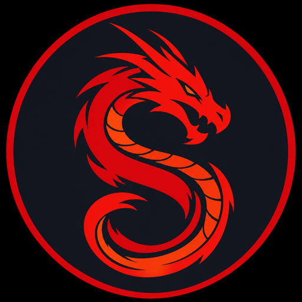

# NmapGUI — Pentest Orkestratörü

<p align="center">
  
</p>

<p align="center">
  <b>nmap GUI değil.</b><br>
  Engagement temelli, asset graph destekli, kill-chain odaklı bir <b>pentest IDE</b>.<br>
  <sub>Recon · Enum · Exploit · Post · Reporting — tek pencerede, audit'lenebilir.</sub>
</p>

<p align="center">
  
  
  
  
  
  
</p>

---

## 🎯 Bu nedir?

NmapGUI, **kapsamı (scope) ve engagement modu** etrafında inşa edilmiş bir pentest istasyonudur. Her tarama, her araç çağrısı, her saldırgan modül **aktif çalışma alanına** yazılır — host'lar bir asset graph olarak birikir, bulgular bir triage kuyruğuna düşer, çıktılar otomatik **kanıt** olarak arşivlenir, MITRE ATT&CK matrisi otomatik dolar, sonunda **PDF/Word raporu** bir tıkla çıkar.

Hedef: pentester'in 20 ayrı sekme, 5 ayrı tool, 3 ayrı not defteri arasında yaşamasını bırakıp **tek pencere + tek workspace + tek rapor** akışına geçmesi.

> **Bu nmap için bir GUI değil.** nmap onun motorlarından sadece biri (nuclei, netexec, sqlmap, hydra, httpx, subfinder, masscan, ffuf, gobuster... aynı seviyede).

---

## 🗺️ Tek bakışta — Kill-chain ↔ Özellik

```
┌───────────────┐   ┌───────────────┐   ┌───────────────┐   ┌───────────────┐   ┌───────────────┐
│  🔍 Recon     │   │  🧪 Enum      │   │  💥 Exploit   │   │  🚀 Post      │   │  📄 Report    │
├───────────────┤   ├───────────────┤   ├───────────────┤   ├───────────────┤   ├───────────────┤
│ Shodan        │   │ Nuclei        │   │ SearchSploit  │   │ Cred Vault    │   │ PDF (zengin)  │
│ crt.sh        │ → │ Web Pipeline  │ → │ Metasploit    │ → │ Hash → Hashcat│ → │ Word (.doc)   │
│ Wayback       │   │ HTTPx + Tech  │   │ Hydra         │   │ Reverse Shell │   │ MITRE Matris  │
│ ASN/Netblock  │   │ Gobuster/FFUF │   │ SQLMap        │   │ TCP Catcher   │   │ Risk Matris   │
│ Favicon Pivot │   │ AD: Null/Sig  │   │ Kerberoast    │   │ HTTP/SMB Share│   │ Asset Graph   │
│ TLS SAN       │   │ AD: Policy    │   │ AS-REP roast  │   │ Pivot Wizard  │   │ Auto Evidence │
│ WHOIS/RDAP    │   │ Bloodhound    │   │ Zerologon     │   │ Chisel/Ligolo │   │ Bulgu Notları │
│ Reverse IP    │   │ HTTP Recon    │   │ NetExec       │   │ Host Notes    │   │ ROE/Müşteri   │
│ Cloud Buckets │   │ Sub Takeover  │   │ MSF Run       │   │ MITRE Otomatik│   │ DOCX Export   │
│ Mail Security │   │ NVD CVSS      │   │ AD Saldırgan  │   │               │   │               │
│ Google Dorks  │   │ Otomatik Exp. │   │               │   │               │   │               │
│ GitHub Dorks  │   │ MITRE Eşleme  │   │               │   │               │   │               │
└───────────────┘   └───────────────┘   └───────────────┘   └───────────────┘   └───────────────┘
        ▲                                                                              │
        └──────────────────── Workspace + Scope + Audit ─────────────────────────────┘
```

---

## ⭐ Öne çıkan özellikler

### 🏗️ Engagement Workspace
- **Çalışma alanları**: her iş için ayrı workspace (lab / engagement modu)
- **Scope guard**: engagement modunda kapsam dışı IP'ye tarama/saldırı **engellenir + audit'lenir**
- **ROE alanı**: izinler, kısıtlamalar, iletişim — raporda kapakta görünür
- **Müşteri / başlangıç-bitiş** metadata raporda yer alır
- **Audit log**: bloklanan denemeler, kimlik ifşaları, rapor üretimleri, listener başlatmaları zaman damgalı kayıt

### 📎 Otomatik Evidence
- Her `nmap`, `nuclei`, `tool:run`, `netexec` çıktısı arka planda buffer'lanır → workspace `evidence/ws-{id}/` klasörüne `.log` olarak yazılır
- Komut + zaman + exit code header'lı transcript
- Manuel screenshot + dosya ekleme de var
- Raporda gömülü resim/dosya referansı

### 🔎 Bulgu Triyajı (Findings)
- nmap NSE / nuclei / AD modülleri → tüm bulgular tek tabloda
- Severity filtresi, "kapalıyı gizle" toggle
- **Status**: open / in_progress / fixed / false_positive / accepted
- Satır içi MITRE technique etiketi + notlar (blur'da otomatik kayıt)
- NVD CVSS zenginleştirme (gerçek skor + severity)
- ExploitDB / searchsploit otomatik eşleme

### 🗝️ Loot (Faz 2)
| Modül | Açıklama |
|---|---|
| **Credential Vault** | DPAPI / Keychain / libsecret ile şifreli depolama. Düz parola renderer'a inmez. Reveal action explicitly audit'lenir. |
| **Hash Detection** | bcrypt, argon2, NTLM, NetNTLMv1/v2, Kerberoast (RC4+AES), AS-REP, MySQL, PostgreSQL, Cisco PBKDF2/scrypt + hex (MD5/SHA1/256/384/512) — 22 pattern, hashcat `-m` modu ile birlikte |
| **Reverse Shell** | 14 payload: bash TCP/UDP, mkfifo nc, python 2/3, php, perl, ruby, PowerShell (uzun + IEX), msfvenom (ELF/EXE/ASPX). URL-encoded + base64 varyantları. |
| **Listener Manager** | TCP catcher (yakalanan shell'e komut gönder), HTTP file server (path traversal koruması), SMB share (impacket). Her biri tek-instance, port doğrulamalı. |
| **Pivot Wizard** | Chisel SOCKS + port forward, ligolo-ng (proxy + agent + tun setup), SSH -D/-L/-R, proxychains config. LHOST otomatik tespit. |

### 🏰 AD Recon (netexec / nxc)
13 hazır modül, ikiye ayrılır:

| Salt-okunur (🔍) | Saldırgan (🔥, engagement + scope gerekli) |
|---|---|
| `null` — null session | `kerberoast` — TGS-REP hash |
| `signing` — SMB signing | `asreproast` — AS-REP hash |
| `users` — AD user enum | `zerologon` — CVE-2020-1472 |
| `policy` — password policy | `petitpotam` — coerce |
| `shares` — SMB share | |
| `loggedon` — oturum açmışlar | |
| `sessions` — aktif SMB | |
| `bloodhound` — All collection | |
| `ntlmrelay` — relay listesi | |

Her modülün **MITRE technique ID'si** otomatik olarak ilgili host'un bulgularına tag'lenir. Çıktıdan `$krb5tgs$`, `$krb5asrep$`, `Signing: False`, zerologon `VULNERABLE` gibi pattern'ler **otomatik finding'e** dönüştürülür.

### 🚀 Web Recon Pipeline
Tek tıkla zincirleme akış:
```
httpx fingerprint
  ↓
Tech tespiti (Wappalyzer-tarzı)
  ↓
Akıllı nuclei -tags türetimi
  (wordpress → wp, jenkins → jenkins, weblogic → weblogic, ...)
  ↓
Subfinder (opsiyonel)
  ↓
İlk 50 subdomain → httpx
  ↓
Top 10 live host → nuclei
  ↓
Bulgular DB'ye + T1595.002 ile otomatik MITRE
```

UI'da live event akışı: her adım renkli satır + stop butonu.

### 🌐 OSINT (15 modül — hepsi pasif, çoğu API-key'siz)

| Kategori | Modül | API |
|---|---|---|
| **Host intel** | Shodan | key |
| | crt.sh subdomain | — |
| | DNS (A/AAAA/MX/NS/TXT/CNAME) | sistem DNS |
| | Wayback Machine URL listesi | — |
| | Reverse IP / virtual host | hackertarget |
| | ASN / netblock | bgpview.io |
| **Cert intel** | TLS Cert + SAN extraction | — (built-in tls) |
| **Hedef tanıma** | Favicon hash pivot | — (saf JS mmh3) |
| | HTTP Recon Bundle | — |
| | WHOIS / RDAP | rdap.org |
| **Saldırı yüzeyi** | Cloud Buckets (S3/Azure/GCS) | — (3rd party HEAD) |
| | Subdomain takeover heuristik | — |
| | Mail Security (SPF/DMARC/DKIM) | sistem DNS |
| **Sızıntı arama** | Google Dorks (25 dork, 7 kategori) | URL builder |
| | GitHub Code Dorks (12 dork) | URL builder |

#### 🔐 TLS Cert + SAN
crt.sh'in **kaçırdığı** subdomain'ler için altın. Sertifikadaki SAN'ları tıklayarak ana hedefini değiştir → diğer paneller yeni hedef üzerine çalışır. Zincir akış.

#### 🪤 Subdomain Takeover
13 provider parmak izi (GitHub Pages, Heroku, AWS S3, Azure cloudapp/azurewebsites/blob, Shopify, Tumblr, Bitbucket, Fastly, Pantheon, Tilda, Unbounce, Helpjuice, Zendesk). CNAME + body fingerprint → **confirmed / likely / safe** sınıflandırması.

#### 🦄 Favicon Hash Pivot
Saf JS MurmurHash3 (Shodan formatı: base64 + 76-char wrap + trailing `\n`). Tek tıkla Shodan ve Censys'te aynı favicon'u çalıştıran **tüm internet** host'ları.

#### ☁️ Cloud Buckets
38 permütasyon × 3 sağlayıcı = 114 hedef, 16 paralel HEAD. 200 (açık) yeşil, 403 (var ama gizli) sarı.

#### ✉️ Mail Security
SPF qualifier + lookup count (RFC 7208 limit), DMARC p/sp/pct/rua, 13 DKIM selector denemesi, BIMI. **Risk skoru 0-100** (yüksek = spoofing kolay).

#### 🌐 HTTP Recon Bundle
Tek tıkla: headers + 13 WAF/CDN fingerprint + robots.txt Disallow + sitemap.xml URL'leri + security.txt + Mozilla Observatory tarzı **güvenlik header skoru (A-F)**.

### 🥷 Stealth Profilleri
| Profil | Bayraklar |
|---|---|
| 📢 Loud | `-T5 --min-rate 5000` |
| ⚖️ Normal | `-T4` |
| 🌒 Stealth | `-T2 -f --source-port 53 --data-length 24 --randomize-hosts` |
| 👻 Paranoid | `-T0 -f --source-port 53 --data-length 32 --randomize-hosts --scan-delay 5s` |

Kullanıcı manuel `-T*` koymuşsa **kullanıcı tercihi kazanır** — profil flag'leri çakışmaz.

### 🕸️ Saldırı Grafiği & MITRE Matris
- **Saldırı grafiği**: radyal SVG, node büyüklüğü = açık servis sayısı, renk = en yüksek severity
- **MITRE matris**: 11 taktik sütunu (TA0043 → TA0011), her sütunda bulgu sayısı + örnek 3 finding

### 📝 Host Notes
Her host için Markdown not (workspace bazlı UPSERT, raporda **bilinçli olarak görünmez** — pentester'ın iç çalışma alanı).

### 📄 Raporlama
- **PDF rapor**: zengin kapak (müşteri, ROE, tarih, risk seviyesi), yönetici özeti, risk matrisi (kritik/yüksek/orta/düşük/info), bulgu tablosu (severity + MITRE + notlar), varlık envanteri, gömülü kanıtlar
- **DOCX export**: Word-uyumlu HTML wrapper, müşteride düzenlenebilir
- **fixed / false_positive** bulguları rapordan otomatik çıkarılır, kaç tane çıkarıldığı yönetici özetinde belirtilir

---

## 🏛️ Mimari

```
┌─────────────────────────────────────────────────────────────────────┐
│                      Renderer (React + Babel)                       │
│       app.jsx — sekmeler, panel'ler, state, IPC tüketimi            │
└──────────────────────────────┬──────────────────────────────────────┘
                               │ contextBridge (preload.js)
                               │ ~80 IPC endpoint
                               ▼
┌─────────────────────────────────────────────────────────────────────┐
│                Main Process (Electron / Node)                       │
│  main.js                                                            │
│  ├─ spawn(nmap, nuclei, netexec, ...) — pentest motoru orkestrası   │
│  ├─ httpsGetJson — Shodan, NVD, bgpview, rdap                       │
│  ├─ tls.connect — sertifika analizi                                 │
│  ├─ safeStorage — credential vault şifreleme                        │
│  ├─ scope guard — engagement saldırgan modülleri kapısı             │
│  ├─ auto-evidence — stdout buffer → workspace evidence/             │
│  └─ listener manager — TCP/HTTP/SMB tek-instance proses             │
│                                                                     │
│  db.js (sql.js — WASM SQLite, native derleme yok)                   │
│  ├─ workspaces (client, scope, mode, ROE, dates)                    │
│  ├─ hosts / services / vulns — asset graph                          │
│  ├─ creds (pass_enc TEXT, hash, hash_type, hashcat_mode)            │
│  ├─ evidence (path, label, type)                                    │
│  ├─ notes (host_ip → markdown)                                      │
│  ├─ audit (action, detail, date)                                    │
│  └─ scans (komut + hedef + sayım)                                   │
│                                                                     │
│  portable.js — Go tabanlı pentest araçlarının resmi binary'leri     │
│                (nuclei, httpx, gobuster, ffuf, subfinder, ...)      │
│                GitHub release'lerinden indirip kuran. WSL'siz.      │
└─────────────────────────────────────────────────────────────────────┘
```

**Sıfır native derleme**: `sql.js` WASM SQLite. Pure Node + Electron 31.
**Saf JS**: mmh3 (favicon hash), Murmur3 algoritması — npm bağımlılığı yok.
**Built-in**: `tls`, `crypto`, `dns.promises`, `https`, `child_process.spawn` — Node standart kütüphanesi.

---

## 📦 Kurulum

### Önkoşullar
| | Windows | Linux | macOS |
|---|---|---|---|
| **Node.js 18+** | ✓ (geliştirme için) | ✓ | ✓ |
| **nmap** | otomatik tespit + kurulum yönergesi | `apt install nmap` | `brew install nmap` |
| **WSL2** | tam araç seti için (opsiyonel) | — | — |

Windows'ta **portable** mod (WSL'siz) varsayılan çalışır: nuclei, httpx, subfinder, gobuster, ffuf, dnsx, katana, chisel, amass GitHub release binary'lerinden tek tıkla indirilir.

### Geliştirme
```bash
git clone https://github.com/Boramantr/nmap-gui.git
cd nmap-gui
npm install
npm start
```

### Windows .exe
```bash
npm run dist
```
Çıktı `dist/` altında NSIS yükleyici.

---

## ⚡ Hızlı başlangıç (10 dakikada engagement)

1. **Workspace oluştur**: `🗂️ Çalışma Alanı` sekmesi → "+ Oluştur"
   - Müşteri adı, scope (CIDR/IP listesi, virgülle), ROE, başlangıç/bitiş
   - Mod: **Engagement** (saldırgan modüller açılır)

2. **Pasif keşif**: `🌐 OSINT` sekmesi → domain gir
   - WHOIS → şirket aralığını öğren
   - ASN → tüm netblock'ları al, scope'a ekle
   - TLS SAN → unutulmuş subdomain'ler
   - crt.sh + Subdomain takeover → quick-win
   - Mail Security → phishing surface (ROE'ye uygunsa)

3. **Aktif keşif**: `🎯 Tarama` → hedef + stealth profili seç → ▶
   - Profil flag'leri otomatik karışır
   - XML parser host'ları workspace asset graph'a yazar
   - Yeni cihazlar audit'e düşer

4. **Enum**: `🧰 Araçlar` → 🚀 **Web Recon Pipeline** → hedef → ▶
   - Tech stack'e göre otomatik nuclei tag'leri
   - Bulgular `🔎 Bulgular` sekmesinde belirir

5. **Triyaj**: `🔎 Bulgular`
   - Severity filtrele, kapalıları gizle
   - Her finding için status + MITRE + not
   - 🕸️ Saldırı grafiği · 🎯 MITRE matris

6. **AD modu** (varsa): `🏰 AD Recon` → DC IP + creds → preset butonlar
   - Salt-okunur'la başla (null, signing, policy)
   - Engagement modunda kerberoast / asreproast / zerologon açılır

7. **Loot**: `🗝️ Loot`
   - Kazanılan creds → vault (şifreli)
   - Hash buldun → otomatik tip + hashcat komutu kopyala
   - Reverse shell payload üret → 📡 dahili TCP catcher başlat
   - Pivot gerekirse → Pivot sekmesi (chisel/ligolo şablonları)

8. **Rapor**: `🗂️ Çalışma Alanı` → 📄 PDF / 📝 Word
   - Kapakta müşteri, ROE, risk seviyesi
   - Bulgu tablosu severity-sıralı, status filtreli
   - Gömülü kanıtlar
   - Asset envanteri

---

## 🔐 Güvenlik ilkeleri (uygulamanın kendi içi)

### 1. Üç katmanlı saldırgan kapısı
Hydra, Metasploit run, AD kerberoast/asreproast/zerologon **aynı 3 kapıdan** geçer:
- **Onay** flag'i (UI açıkça soruyor)
- **Engagement modu** kontrolü
- **Scope** içinde mi
Reddedilen her deneme `audit` tablosuna `blocked` action'ı ile yazılır.

### 2. Credential vault
- Düz parola **renderer'a hiçbir zaman gönderilmez** — sadece `creds:reveal` IPC ile, audit'lenerek
- `safeStorage`: Windows DPAPI · macOS Keychain · Linux libsecret
- Anahtarlık yoksa `PLAIN:` prefix ile işaretlenir, UI'da uyarı görünür

### 3. Komut enjeksiyon koruması
Tüm user input'lar regex doğrulamadan geçer:
- Hedefler: `/^[a-zA-Z0-9._:\/\-]+$/`
- Kullanıcı adları: `/^[A-Za-z0-9._\\\/@-]{1,80}$/`
- NTLM hash: `/^[A-Fa-f0-9:]{16,200}$/`
- MSF/searchsploit arama: harf+rakam+kısıtlı semboller
- Spawn argümanları array olarak verilir, shell-string olarak değil

### 4. Listener güvenliği
- Tek-instance per type
- Port 1-65535 doğrulama
- HTTP server path traversal koruması (`path.resolve` + prefix check)
- Uygulama kapanırken otomatik temizlik (`before-quit`)

### 5. OSINT pasifliği
Cloud bucket prob'ları 3rd party endpoint'lere gider; hedefin altyapısına paket atılmaz. Bunu istemiyorsan butonu kullanma.

---

## ⚠️ Etik & Yasal

**Bu araç yalnızca yetkilendirilmiş güvenlik testleri içindir.**

- Kendi ağınız, açıkça yazılı izin verdiğiniz sistemler, CTF / lab ortamları, kayıtlı bug bounty programları, yetkili pentest sözleşmeleri kapsamında kullanın.
- Engagement modu **otomatik bir yasal koruma değil**, sadece yanlışlıkla scope dışı tarama yapmanı engelleyen bir tasarım kapısı.
- Saldırgan modüller (Metasploit run, hydra, kerberoast, zerologon, AS-REP roast, NTLM relay listesi) **gerçek etki yapar**. Çalıştırma sorumluluğu kullanıcıdadır.
- Geliştirici(ler) yanlış kullanım için sorumluluk kabul etmez.

> İhlal olur ya da şüphen olursa: önce yazılı yetkilendirme. Sözlü "olur" yetki değildir.

---

## 🗂️ Klasör yapısı

```
nmap-gui/
├── src/
│   ├── main/
│   │   ├── main.js          # Electron ana süreç, ~80 IPC, motor orkestrası
│   │   ├── preload.js       # contextBridge — güvenli IPC köprüsü
│   │   ├── db.js            # sql.js — workspaces/hosts/services/vulns/creds/notes/...
│   │   └── portable.js      # Go araçlarının portable binary indiricisi
│   └── renderer/
│       ├── app.jsx          # Tüm UI: sekmeler, paneller, state (~250 KB)
│       ├── app.js           # Build edilmiş JS (gitignore değil — runtime için)
│       ├── styles.css       # Tema, tablo, kart, kanban tasarımı
│       └── index.html
├── assets/                  # İkonlar, logo
├── build-renderer.js        # JSX → JS Babel derleyici (build adımı)
├── build-logos.js           # Vendor logo SVG'lerini bundle eder
├── build-icon.js            # Platform ikonları
└── package.json
```

---

## 🛠️ Geliştirici notları

### Yeni bir IPC endpoint eklemek
1. `main.js` — `ipcMain.handle('your:thing', async (e, args) => {...})`
2. `preload.js` — `yourThing: (args) => ipcRenderer.invoke('your:thing', args)`
3. `app.jsx` — `await window.api.yourThing(args)`

### Yeni bir saldırgan modül eklemek
Scope guard pattern'ini takip et:
```js
const ws = db.getActiveWorkspace();
if (!ws || ws.mode !== 'engagement') {
  if (ws) db.addAudit(ws.id, 'blocked', `reddedildi: ${reason}`);
  return { ok: false, error: 'Engagement modu gerekli' };
}
if (inScopeMain(target, ws.scope) !== true) {
  db.addAudit(ws.id, 'blocked', `kapsam dışı: ${target}`);
  return { ok: false, error: 'Scope dışında' };
}
```

### DB göçü
`db.js` → `initDb()` içine `try { db.run("ALTER TABLE ... ADD COLUMN ...") } catch(e) {}` ekle. `sql.js` ALTER'ı idempotent yapmıyor — try/catch göç deseni.

### Build
```bash
npm start          # build + electron
node build-renderer.js   # sadece JSX → JS
npm run dist       # NSIS .exe
```

---

## 🗺️ Yol haritası

- [ ] **Vite + gerçek React bundle** — JSX runtime yerine prod build
- [ ] **Kod imzalama sertifikası** — Windows SmartScreen uyarısı için
- [ ] **Mobile app paneli** (apk decompile + manifest analizi + Frida hook bash)
- [ ] **API testing modülü** (Postman tarzı, OpenAPI import)
- [ ] **CVE feed otomasyonu** — günlük NVD diff
- [ ] **BloodHound CE entegrasyonu** — bulk import + cypher query
- [ ] **Multi-user / team sync** (paylaşımlı workspace export/import)
- [ ] **DefectDojo / Jira issue push** — finding'lerden CSV/JSON
- [ ] **Threat model export** (STRIDE / PASTA template)
- [ ] **Web fuzzing wordlist yönetimi** (SecLists otomatik klon)
- [ ] **Sertifika analizinde zayıf cipher tespiti** (sslscan benzeri inline)
- [ ] **Email format guesser + breach search** (HIBP entegrasyon, key'lı)

---

## 🤝 Katkı

PR'lar ve issue'lar açıktır. Büyük değişiklik öncesi issue açıp tartışırsan vakit kazandırır.

### Commit stili
- Türkçe veya İngilizce, **ne** + **neden**
- Bir commit = bir bağlam (rapor değişikliği + AD modülü + UI tema → 3 commit)
- Saldırgan yeni modül ekliyorsan **scope guard'ı atlatma**

---

## 📜 Lisans

MIT — özgürce kullan, ama sorumluluk sende. Bkz. [LICENSE](LICENSE).

---

## 🙏 Teşekkürler

- [nmap](https://nmap.org) · [nuclei](https://github.com/projectdiscovery/nuclei) · [netexec](https://github.com/Pennyw0rth/NetExec) · [impacket](https://github.com/fortra/impacket) · [chisel](https://github.com/jpillora/chisel) · [ligolo-ng](https://github.com/nicocha30/ligolo-ng) · [searchsploit](https://gitlab.com/exploit-database/exploitdb)
- [bgpview.io](https://bgpview.io) · [crt.sh](https://crt.sh) · [Wayback Machine](https://web.archive.org) · [rdap.org](https://rdap.org) · [hackertarget.com](https://hackertarget.com)
- MITRE ATT&CK · Mozilla Observatory · MurmurHash3 (Austin Appleby)

---

<p align="center">
  <sub>Yalnızca yetkili güvenlik testleri için. <a href="#%EF%B8%8F-etik--yasal">Etik bölümünü</a> bir kez daha oku.</sub>
</p>
